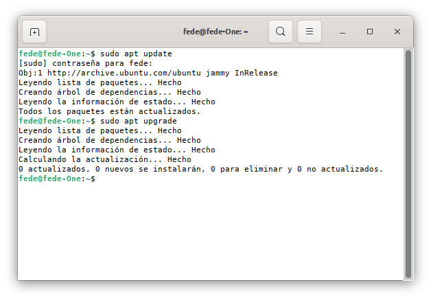
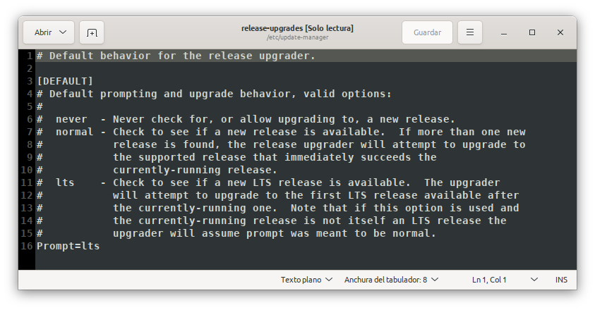
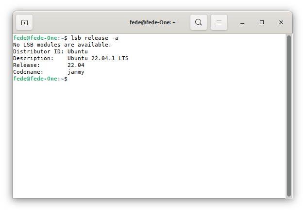
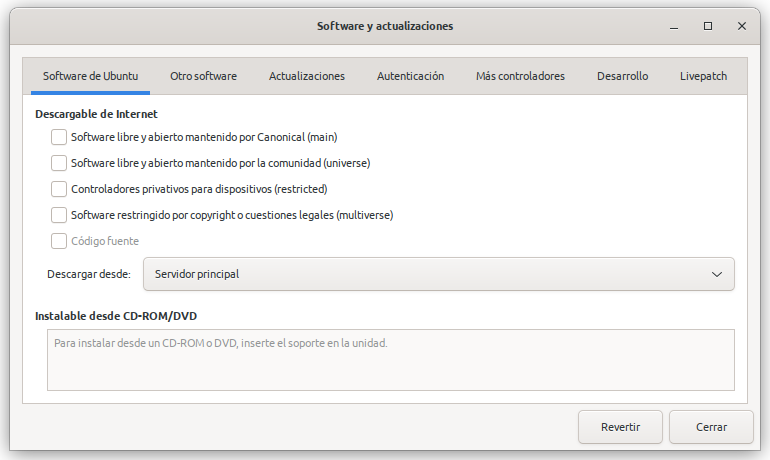
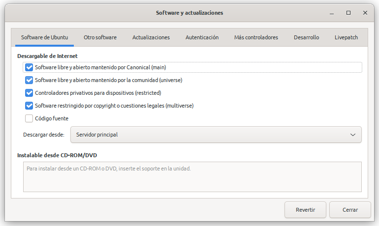

# <FONT COLOR=#8B008B>Actualizar Ubuntu 20.04 a Ubuntu 22.04</font>
Antes de nada debemos tener presente que el proceso puede provocar perdida de datos por lo que lo mas apropiado es sacar copia de seguridad antes de hacer nada.

Lógicamente, y salvo los problemas que ponga en estas notas, todo ha ido bien en mi caso.

Lo primer es tener bien actualizado nuestro sistema sin ningún tipo de error o problema. Para ello abrimos una terminal y ejecutamos los comandos update y upgrade. En la figura 1 vemos el resultado que debemos tener.

<center>

  
*Figura 1. Comandos update y upgrade en un sistema bien actualizado*

</center>

Podemos configurar en el fichero /etc/update-manager/release-upgrades como queremos trabajar con las actualizaciones según configuremos el 'Prompt' entre las opciones que vemos en la Figura 2.

<center>

  
*Figura 2. Opciones de configuración del Prompt en release-upgrades*

</center>

Esto no es mas que el comportamiento predeterminado para la actualización de versiones, que tiene como opciones válidas las siguientes:

* **never**. No se permite ni verificar ni actualizar

* **normal**. Se comprueba si hay una nueva versión disponible y si se encuentran varias el actualizador intentará actualizar a la versión que suceda inmediatamente a la que se está ejecutando actualmente.

* **lts**. Comprueba si hay disponible una nueva versión LTS posterior a la que se esté ejecutando actualmente, aunque esta no sea LTS. Las siglas LTS indican que la versión tiene soporte a largo plazo (Long Time Support). En Ubuntu las versiones LTS tienen soporte y son actualizadas durante 5 años mientras que las versiones normales tienen soporte durante 9 meses, lo  que no significa que sea una versión que funcione mal sino que deberemos actualizar en un plazo corto de tiempo.

A continuación procedemos a ejecutar la actualización escribiendo en una terminal:

```
sudo do-release-upgrade
```

Hay que tener en cuenta que el proceso puede ser largo y que no es totalmente desatendido y en algunos momentos nos preguntará que hacer, razón por la que debemos estar atentos a la pantalla del ordenador.

Una vez finalizado el proceso probablemente nos pregunte si queremos reiniciar el sistema, a lo que debemos contestar que si para que se apliquen todas las actualizaciones de forma correcta. Una vez reiniciado el ordenador podemos comprobar la versión instalada de la forma que vemos en la Figura 3.

<center>

  
*Figura 3. Comprobación de la versión de Ubuntu instalada*

</center>

Si todo ha transcurrido con normalidad debemos tener instalado como sistema operativo la versión Ubuntu 22.04 LTS denominada "Jammy Jellyfish" cuyo logo vemos en la Figura 4.

<center>

  
*Figura 4. Ubuntu 22.04 LTS denominada "Jammy Jellyfish"*

</center>

Aunque no lo he probado el proceso seguido desde la terminal de comandos debe valer para todos los sabores de Ubuntu.

## <FONT COLOR=#007575>**Solución de errores apt update comunes**</font>

Si cuando hacemos update y upgrade obtenemos una ventana con errores es porque el apt tiene algún error típico. En algunos casos en la propia ventana de errores nos va a indicar como solucionarlo pero si aún así siguen apareciendo lo que debemos hacer es restaurar el comando a su origen. Para este fin vamos a utilizar el comando rm con algunas de sus opciones. El comando rm (remove) se utiliza para eliminar archivos y directorios.  

El primer comando que debemos ejecutar en una terminal para restaurar apt update es:

```
sudo rm /etc/apt/sources.list
```

Cuando pulsamos 'Enter' lo que hacemos es eliminar el archivo sources.list que tenemos en /etc/apt/.

Ahora tecleamos:

```
sudo rm /etc/apt/sources.list.d/* -vf
```

Eliminamos sources.list.d en el mismo directorio pero con los parámetros vf. La v es de 'verbose' o modo detallado, es decir nos explica en todo momento las acciones que se están ejecutando y la f corresponde a 'force', o sea que lo elimina sin confirmación.

En la web existen infinidad de páginas donde consultar comandos de Linux y en la webgrafia he puesto enlace a un par de ellas.

Ahora vamos a escribir en la terminal el comando siguiente:

```
sudo software-properties-gtk
```

Esto nos devolverá la ventana que vemos en la Figura 5.

<center>

  
*Figura 5. Ventana de Software y actualizaciones reiniciada*

</center>

Aquí procedemos a configurar como vemos en la Figura 6.

<center>

  
*Figura 6. Ventana de Software y actualizaciones: pestaña Software de Ubuntu*

</center>

En la Figura 7 vemos la configuración establecida en mi caso para las actualizaciones y se destaca la fecha final de soporte y actualizaciones para esta versión LTS.

<center>

  
*Figura 6. Ventana de Software y actualizaciones: pestaña Actualizaciones*

</center>

Cerramos la ventana anterior y ejecutamos desde la terminal el comando siguiente:

```
sudo apt update
```

El sistema debería funcionar con normalidad a partir de este momento.

## <FONT COLOR=#007575>**Aviso importante**</font>
Aunque tengamos éxito en el proceso descrito es muy probable que algunas aplicaciones no funcionen correctamente y lo que aconsejo, dada la rapidez con la que se puede hacer, es eliminarlas e instalarlas de nuevo.

## <FONT COLOR=#007575>**Webgrafia**</font>

* [Cambiate a Linux](https://cambiatealinux.com/actualizar-ubuntu-20.04-a-ubuntu-22.04)

* [Ayuda Linux](https://ayudalinux.com/como-usar-el-comando-rm/)

* [programador clic](https://programmerclick.com/article/33181158698/)

* [https://tecnonautas.net/](https://tecnonautas.net/una-guia-rapida-para-usar-comandos-rm-de-linux/)

* Una web 100% recomendable es [Tutoriales Ubuntu](https://www.tutorialesubuntu.com/2020/08/01/solucionar-errores-apt-get-update-y-restaurar-repositorios/), con infinidad de tutoriales en Español.
