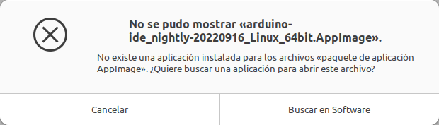
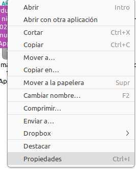
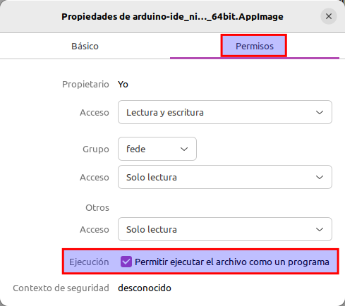
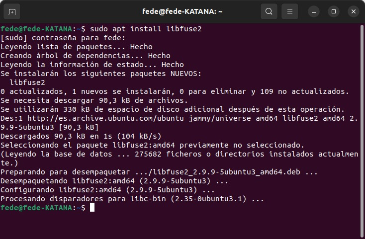

#  Los archivos AppImage no funcionan
El formato AppImage brinda una forma de ejecutar aplicaciones en cualquier distribución Linux sin necesidad de instalación a través de paquetes DEB/RPM. ES decir, AppImage es un formato de paquete de software universal o lo que es lo mismo, una imagen comprimida en la que están incluidas todas las dependencias y bibliotecas necesarias para que el programa funcione.

El proceso para usar AppImage es sencillo y basta seguir estos pasos:

**Paso 1**. Descargamos el paquete .appimage. Tenemos muchisimos sitios de donde podemos descargar en este formato como por ejemplo, [Arduino](https://www.arduino.cc/en/software), [FreeCAD](https://www.freecad.org/downloads.php?lang=es_ES), [Prusa Slicer](https://help.prusa3d.com/es/article/descarga-prusaslicer_2220) o cualquiera de los que tenemos en este [listado](https://github.com/AppImage/AppImageKit/wiki/AppImages).

**Paso 2**. Debemos dar permiso de ejecución al archivo .appimage descargado ya que no los tendrá. No es necesario ser root para hacerlo. Si intentamos ejecutar un archivo sin darle permiso nos aparecerá el mensaje que vemos en la imagen siguiente:

*Archivo .appimage sin permiso de ejecución*

Para hacer un archivo .appimage ejecutable nos situamos sobre el nombre del archivo, clicamos botón derecho del ratón y escogemos la opción 'Propiedades', tal y como vemos en la imagen siguiente:

*Acceso a Propiedades en un archivo .appimage*

Esto nos despliega una ventana en la que debemos dirigirnos a la pestaña 'Permisos' y marcar la opción que se muestra en la imagen siguiente:

*Activar permiso de ejecución en un .appimage*

**Paso 3**. Ejecutar el archivo y se lanzará la aplicación correspondiente. Si estamos en Ubuntu 22.04 LTS es muy posible que <b>No se pueda ejecutar el archivo AppImage</b> al que acabamos de dar permiso de ejecución.

El problema radica en que por defecto Ubuntu 22.04 no incluye la biblioteca FUSE que es la encargada de proporcionar una interfaz para que los programas exporten un sistema de archivos virtual al kernel de Linuxy justo así es como funciona AppImage, en un sistema de archivos virtuales por lo que sin esta biblioteca AppImage no funciona.

Es muy sencillo solucionar el problema pues basta con abrir una terminal, teclear *sudo apt install libfuse2*, pulsar Enter y se instalará la biblioteca tal y como vemos en la figura siguiente.

~~~
sudo apt install libfuse2
~~~

*Instalación de la biblioteca FUSE*

Si el archivo .appimage todavía no se ejecuta es muy probable que la AppImage descargada tenga algún problema que impide su ejecución. Lo aconsejado es probar con otros archivos de este tipo y ver si el sistema está funcionando correctamente.

Para profundizar un poco mas en el problema de ejecución de AppImage podemos intentar su ejecución de la misma manera que ejecuta un script de shell desde una terminal.

~~~
./nombre_aplicacion.appimage
~~~

El análisis del error puede ser de mucha ayuda pero puede requerir conocimientos avanzados de Linux.
