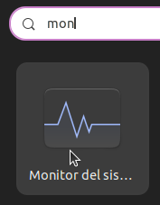
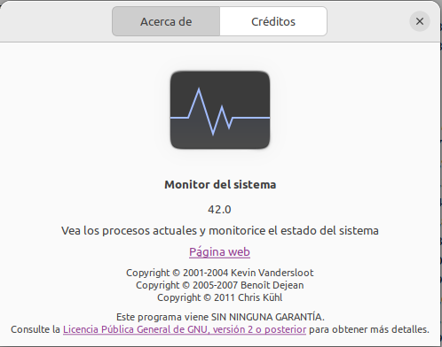
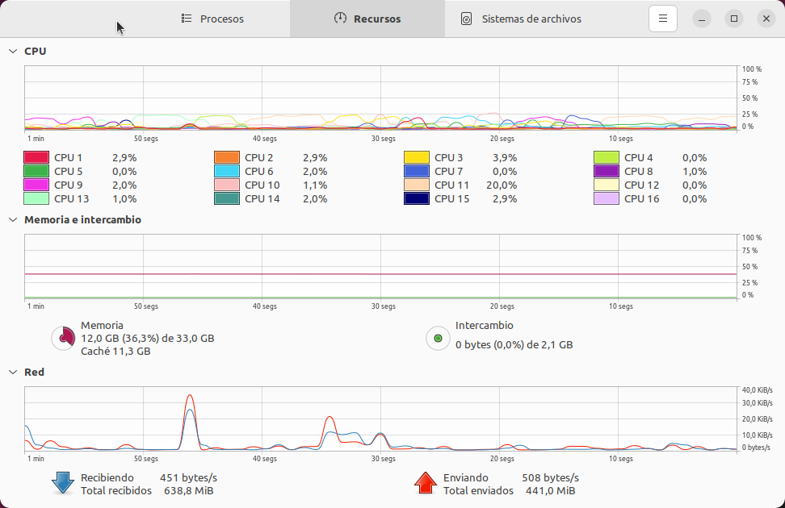
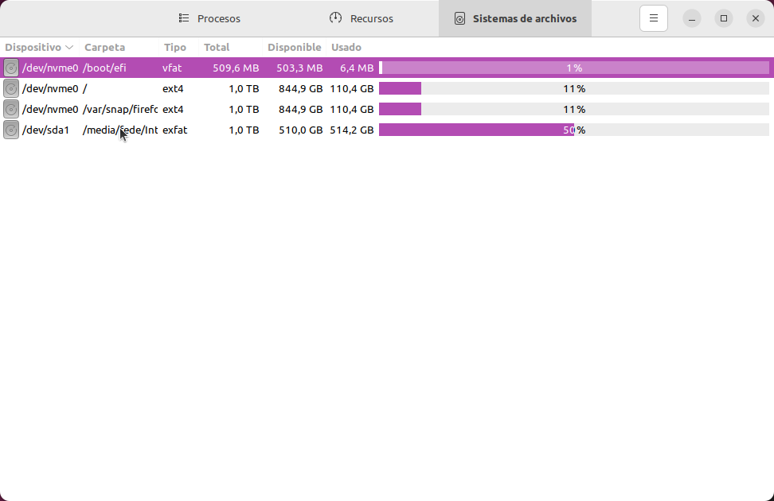
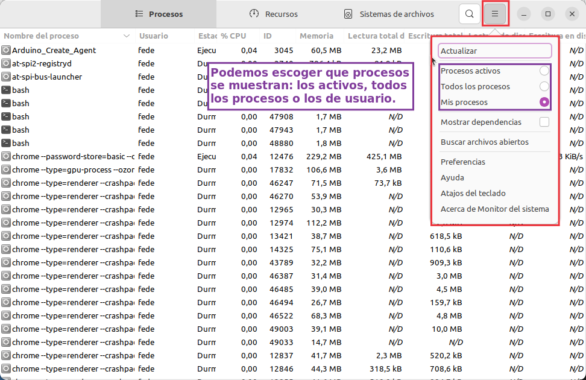
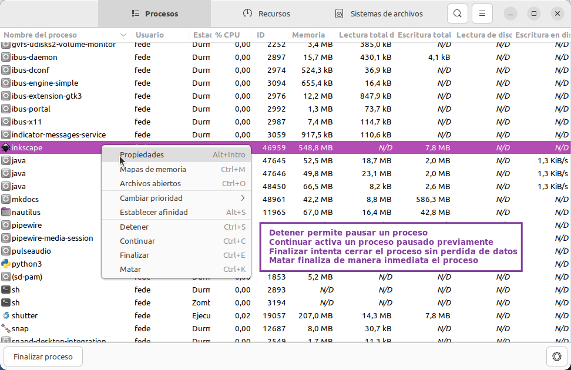
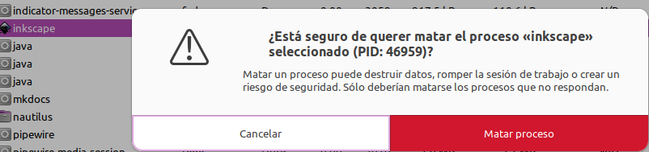

# <FONT COLOR=#8B008B>Cerrar programas que no responden en Ubuntu 22.04</font>
Cuando se nos presenta este problema y no hay de forma de cerrar el programa de las maneras usuales tenemos que conocer la forma de hacerlo sin recurrir a reiniciar el sistema o cerrar la sesión.

Aquí vamos a ver rapidamente como hacerlo desde el entorno gráfico utilizando la aplicación ```Monitor del sistema```:

<center>

  
*Localizar la aplicación desde Mostrar aplicaciones*

</center>

Esta es la información que la aplicación nos da en su 'Acerca de':

<center>

  
*Monitor del sistema. Acerca de*

</center>

Una vez localizada la aplicación la abrimos y se mostrará una ventana similar a la siguiente, donde se pueden ver los recursos del sistema y su uso actual.

<center>

  
*Mostrar del sistema. Recursos*

</center>

A continuación vemos la pestaña 'Sistema de archivos' y su uso en el equipo que se está ejecutando.

<center>

  
*Monitor del sistema. Sistema de archivos*

</center>

Finalmente vemos la pestaña 'Procesos', con el menú de opciones desplegado. En esta ventana vemos los procesos según nuestra selección y podemos seleccionar que se muestren las dependencias entre procesos, lo que nos permitirá ver si la ejecución de un proceso depende de la de otro diferente.

<center>

  
*Monitor del sistema. Procesos*

</center>

Cuando tengamos localizado el proceso que nos interesa y con el cursor del ratón situado sobre el mismo haremos clic con el botón secundario y se mostrará el menú contextual que vemos a continuación.

<center>

  
*Monitor del sistema. Acciones sobre un proceso*

</center>

La opción finalizar está disponible mediante el botón de la parte inferior izquierda.

Cuando escogemos una de las opciones se muestra la ventana de aviso siguiente:

<center>

  
*Monitor del sistema. Confirma o cancelar Detener, finalizar o Matar*

</center>

La leyenda del botón cambia para adaptarse a la opción elegida. Una vez aceptada la opción se ejecuta. Se aconseja Finalizar los procesos antes de recurrir a la opción de 'Matar', especialmente si hay posibilidad de perdida de datos.

