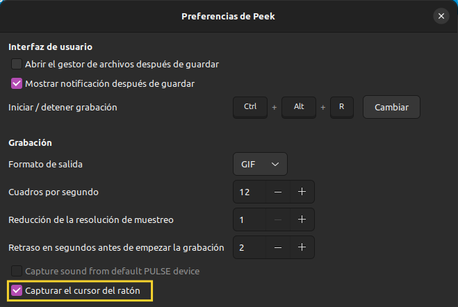
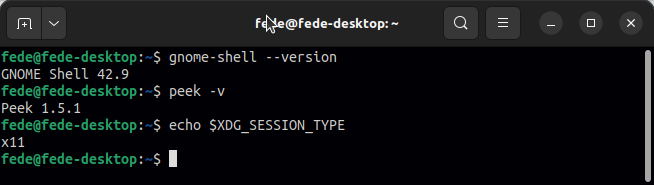
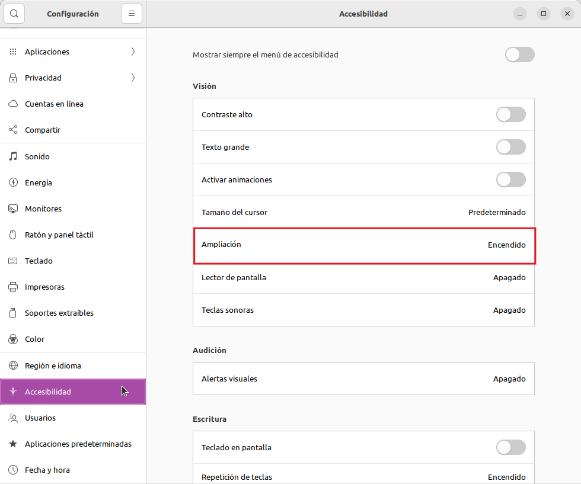
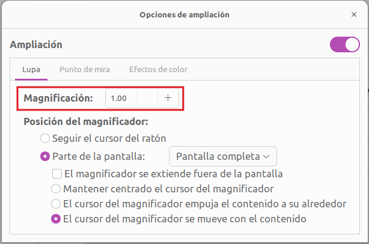

# Peek no graba el cursor
En Ubuntu 22.04 he estado teniendo un problema con la creación de gif animados mediante la aplicación Peek y es que, aunque la opción está claramente marcada en las preferencias, este realmente no aparece en las grabaciones.

En la imagen vemos las preferencias de Peek

  
*Preferencias de Peek*

La situación de referencia en cuanto a versiones de Gnome, Peek y tipo de XDG utilizado los vemos a continuación:

  
*Versiones y XDG*

Los comandos utilizados son:

~~~shell
gnome-shell --version
peek -v
echo $XDG_SESSION_TYPE
~~~

La solución que he encontrado sin tocar casi nada de configuraciones es activar el magnificador. Para ello abrimos la Configuración y nos dirigimos a accesibilidad y activamos Ampliación:

  
*Opciones de accesibilidad*

Que para que no afecte a la visualización he configurado así:

  
*Opciones de Ampliación*

