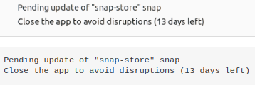

# Problema con actualización de Snap Store
El problema radica en un mensaje de aviso bastante curioso del sistema que viene a decir algo como que:

*No se puede actualizar "Snap Store": no se puede actualizar "snap-store": snap "snap-store" tiene aplicaciones en ejecución (ubuntu-software)*

En la imagen siguiente se ha capturado el mismo:

*Problema de actualización de Snap Store*

Esto puede ocurrir porque el proceso de almacenamiento instantáneo se inicia en segundo plano aunque no está haciendo nada.

Lo primero que debemos probar es:

~~~
sudo snap refresh
~~~

Y también se puede probar a finalizar ese proceso de almacenamiento instantáneo con el comando:

~~~
sudo pkill snap-store 
sudo snap refresh snap-store
~~~

Si lo anterior no funciona podemos matar al demonio snap-store, haciendo:

~~~
sudo killall snap-store
sudo snap refresh
~~~

O bien esto:

~~~
sudo killall snap
sudo snap refresh snap-store
~~~

O este otro:

~~~
sudo killall snap-store 
sudo snap refresh snap-store
~~~

Y ya se puede reiniciar el centro de control de software de Ubuntu Snap. Cuidado con los comandos killall si no se controla lo que hacen porque podemos eliminar cosas que no queremos.

Otra opción es eliminar la tienda:

~~~
sudo snap remove snap-store
~~~

Para volver a instalarla con:

~~~
sudo snap install snap-store
~~~

Hay que tener presente que después de estos procedimientos la tienda tardará un poco en iniciarse porque tiene que descargarse de nuevo.
