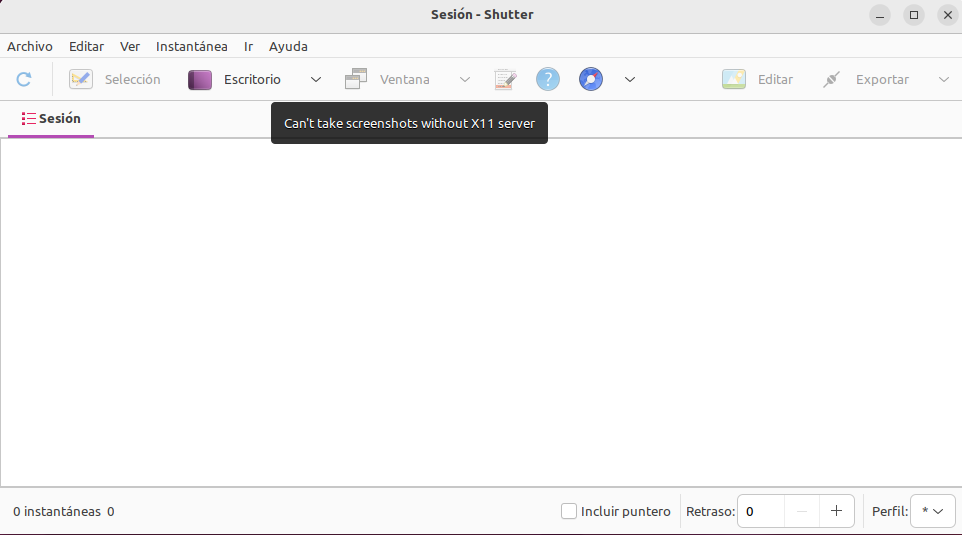
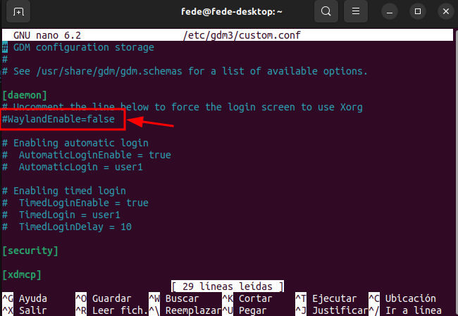
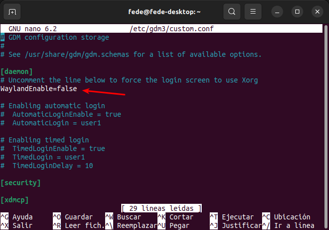
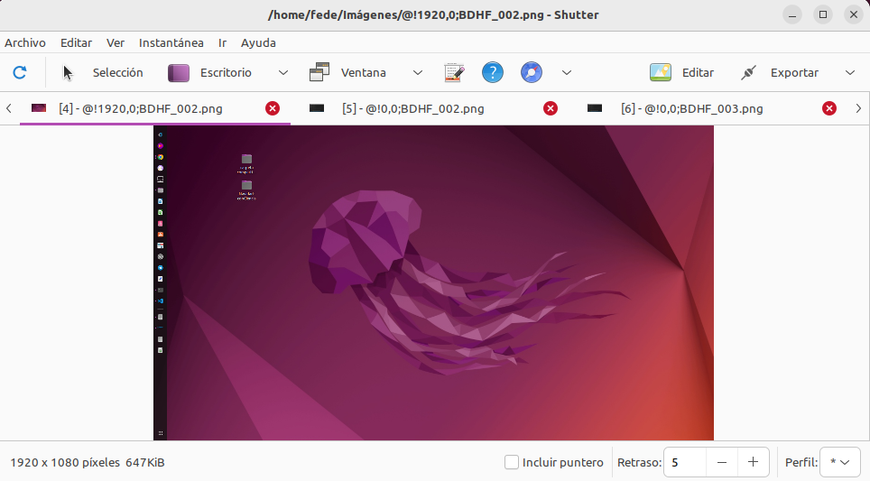

# Problema con actualización de Snap Store
Es muy posible que tras instalar Shutter en nuestro ordenador en Ubuntu 22.04 tengamos el problema de que este tan solo nos deja capturar el escritorio y la mayoría de las opciones están desabilitadas, tal y como se aprecia en la im agen siguiente.

*Shutter sin X11 server*

En la imagen anterior vemos el mensaje que nos indica claramente que no se pueden tomar capturas de pantalla sin X11 server.

Shutter no puede tomar capturas de pantalla en Ubuntu 22.04 porque ahora se utiliza Wayland como sistema de ventanas predeterminado, en lugar de X11, y Shutter por ahora solo funciona con el sistema de ventanas X11, que anteriormente era el predeterminado de Ubuntu antes de la versión Ubuntu 22.04.

Tenemos una solución sencilla habilitando Wayland en el archivo custom.conf que se encuentra en la ruta etc/gdm3 y que podemos editar copiando la línea siguiente en una terminal:

~~~
sudo nano /etc/gdm3/custom.conf
~~~

En la figura siguiente vemos abierto el archivo y se ha marcado la línea que tenemos que descomentar.

*Wayland comentado*

En la figura siguiente vemos la línea sin comentario.

*Wayland no comentado*

En estas condiciones guardamos los cambios realizados en el archivo, salimos del editor nano y reseteamos gnome mediante la siguiente orden en una terminal:

~~~
sudo systemctl restart gdm3
~~~

Ahora podemos ejecutar de nuevo Shutter y comprobar que todas las opciones están activadas, tal y como vemos en la imagen siguiente:

*Shutter sin problemas*

